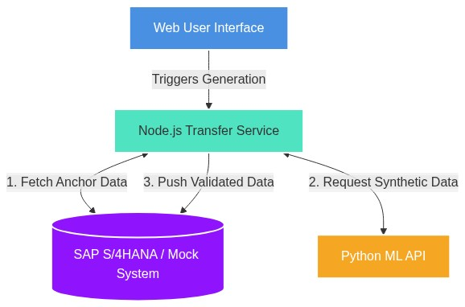
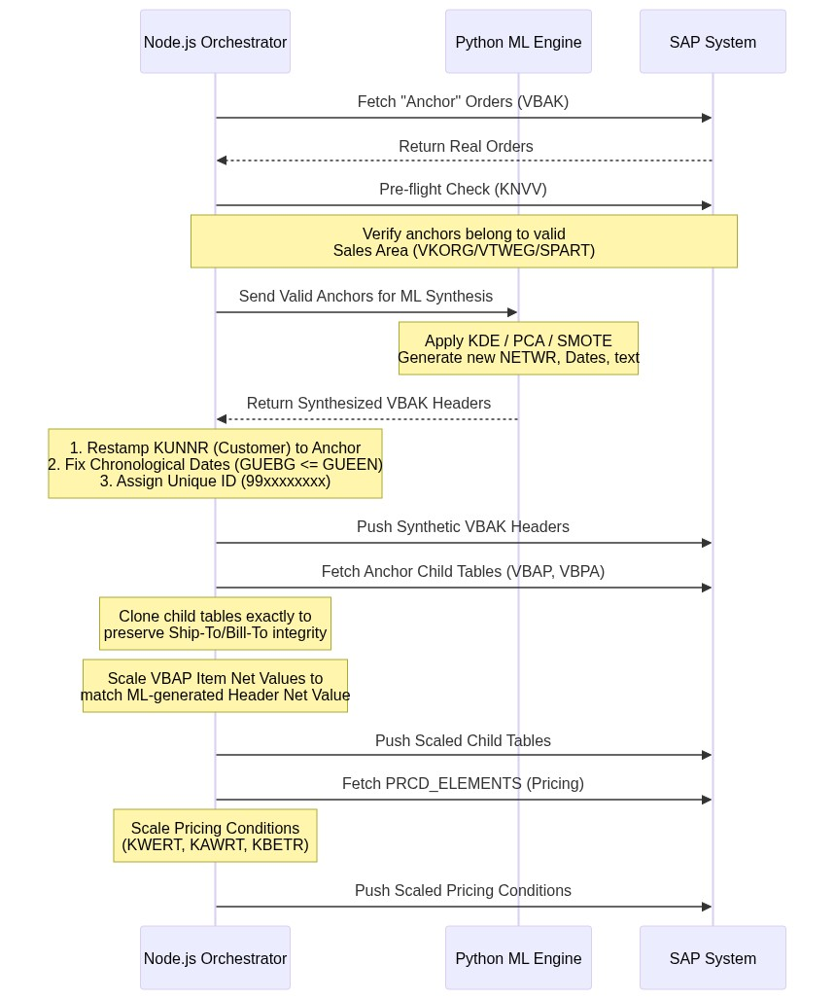

# Test Data Engine (TDE)
## System Architecture & Workflow Documentation

---

### 1. Executive Summary

The **Test Data Engine (TDE)** is an advanced, automated pipeline designed to generate high-quality, mathematically consistent synthetic test data for SAP systems. It bridges the gap between raw data generation and strict ERP business rules. 

By utilizing a hybrid architecture—combining **Machine Learning (ML)** for realistic data variance and **Deterministic Rules** for SAP structural integrity—TDE safely generates thousands of valid sales orders (`VA03`) without corrupting SAP relational databases or failing backend validation checks.

---

### 2. High-Level System Architecture

The TDE platform consists of three decoupled macro-components working in tandem:

1. **Node.js Transfer Service (Orchestrator):** The brain of the system. It handles SAP OData communication, extracts real "anchor" data, orchestrates the ML API, enforces strict business rules, scales mathematical pricing, and pushes the final payloads back into SAP.
2. **Python Synthetic API (ML Engine):** A dedicated Python service that ingests real SAP records and applies classical Machine Learning algorithms (Gaussian KDE, PCA, SMOTE) to generate statistically realistic, varied datasets.
3. **SAP Target System:** The destination database where standard business objects (like `SALES_DOCUMENT`) are inserted using standard SAP OData entities (`FetchDataSet`, `InsertDataSet`).

---

### 3. Step-by-Step Data Generation Pipeline

The generation pipeline is meticulously designed to satisfy SAP's rigid referential integrity checks (e.g., ensuring a customer actually belongs to a specific Sales Organization).

---

### 4. Core Technologies & ML Methodologies

#### A. The Python ML Engine (Data Variance)
Depending on the volume of reference data provided, the ML engine dynamically selects the best algorithm to synthesize new values:
* **Massive Data (>50 records):** Utilizes **Gaussian Kernel Density Estimation (KDE)** to map the exact probability distribution of numeric fields and sample realistically from them.
* **Small Data (≤50 records):** Utilizes **Principal Component Analysis (PCA)** with Gaussian Noise and **SMOTE-style K-Nearest Neighbors (KNN)** interpolation to intelligently bridge gaps between sparse data points.
* **Categorical Data:** Uses weighted independent sampling to mix and match text and categorical fields realistically.

#### B. The Node.js Transfer Service (Data Integrity)
To ensure the ML-generated data doesn't get rejected by SAP, the Node.js layer acts as a strict "Business Rule Firewall." It applies the following mandatory transformations:
1. **Mathematical Consistency Scaling:** If the ML generates a new Total Order Value (`VBAK.NETWR`), the Node server mathematically scales the underlying Item Values (`VBAP`) and the raw Pricing Conditions (`PRCD_ELEMENTS`) by the exact ratio. This ensures `VA03` Overview tabs match the Conditions tab down to the penny.
2. **Customer Validity Enforcement:** The ML engine's random generation is overridden for critical Sales Area fields (`KUNNR`, `VKORG`, `VTWEG`, `SPART`). The Node server strictly overlays perfectly valid customer setups from the anchor data to prevent "Sold-to party not maintained" errors.
3. **Partner Function Protection (`VBPA`):** Ship-To, Bill-To, and Payer configurations are cloned exactly as they exist in reality, ensuring addresses (`ADRNR`) and partner IDs resolve correctly.
4. **Chronological Safeguards:** Ensures standard SAP date validities are logically sound (e.g., `Valid From` is never after `Valid To`).
5. **Collision-Free IDs:** Assigns generated document numbers (`VBELN`, `KNUMV`) from a highly sequestered `99xxxxxxxx` number range, completely removing the risk of overwriting real production or test data.

---

### 5. Conclusion
The Test Data Engine represents a highly resilient, enterprise-grade approach to synthetic data. By completely isolating the *statistical generation* (Python) from the *business rule enforcement* (Node.js), the platform achieves the ultimate goal: **High-variance, highly realistic test data that loads flawlessly into SAP without triggering structural validation errors.**
